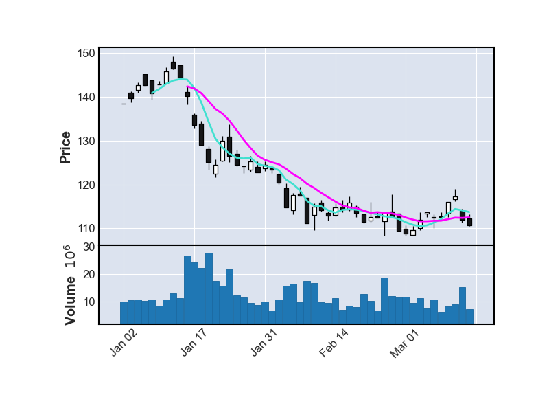

# Portfolio Optimization with CQMs

Using Constrained Quadratic Models, we can set an objective function and constraints for a given problem. Here, we will be working on making a program which gives an optimized selection of stocks. 

In this exercise, two-year data for 10 stocks are used and their average return rates are calculated using daily closing prices. The stocks that we will consider in this exercise are "T" (AT&T), "SFL" (FSL), "PFE" (Pfizer), "XOM" (Exxon Mobil), "MO" (Altria Group), "VZ" (Verizon Communications), "IBM" (IBM), "TSLA" (Tesla), "GILD" (Gilead Sciences), and "GE" (General Electric). In the folder `data` we have provided CSV files with daily closing prices and monthly returns for each stock in this period of time.

Using available data, we can analyze stocks individually. For example, the figure below shows a 50-day candlestick chart and its moving average over 5-day and 10-day windows for stock GE. However, a much more effective way to optimize a portfolio is to consider a collection of stocks and how they might balance each other out.

To effectively optimize a portfolio of stocks, we would like to take into consideration:

   1. average returns,

   2. available budget,

   3. and variance between stocks.

For condition 1, we use average return rates prepared in the CSV file, `monthly_returns.csv`, in order to build a model that will maximize our anticipated returns.

For condition 2, we use the last day's closing price from the file, `lastday_closing_price.csv`, to ensure that we are not exceeding the available budget.

For condition 3, we can compute the covariance between pairs of stocks from the average returns information that is available. Covariance allows us to take into account how similar or different the behavior of the two stocks are. When the covariance is large, the two stocks behave in a similar manner - if one stock value drops then it's likely that the other will as well. We want to minimize the covariance in order to minimize the risk of the portfolio. The covariance is calculated in the exercise program files and provided for use.

## Exercise 1

In exercise 1, we build a basic portfolio of two stocks in order to maximize returns.

Open up the code file `excercise_1.py` file.

   1. Define a binary variable named `s_stk` for each stock 'stk', and store the variables in a list called `stocks`, which will be returned by the `define_variables` function

   2. In the `build_cqm` function:
   
      - Initialize the CQM object called `cqm`, and import any necessary packages

      - Add a constraint to the CQM to choose exactly two stocks. Use the label 'choose k stocks'.

      - Set an objective function in the CQM to maximize returns

   3. In the `sample_cqm` function:

      - Define the sampler to be used. Remember to import any necessary packages.

      - Sample the CQM object and return the SampleSet

## Exercise 2

For exercise 2, we start with the CQM built in exercise 1, and add a constraint for the available budget.

   1. Repeat steps 1 to 3 of exercise 1

   2. In the `build_cqm` function, add a constraint to the CQM that the cost of the purchased stock should be at most our budget. Use the label 'budget_limitation'.

## Exercise 3

For exercise 3, we start with the CQM built in exercise 2, and add an additional objective to minimize variance.

   1. Repeat steps 1 to 2 of exercise 2

   2. In the `build_cqm` function, add "minimize variance" to the objective. Some hints:

      - Determine each objective separately then add them together

      - Variance is computed as a quadratic term: `variance[i][j]*stock[i]*stock[j]` for **distinct** pairs (i, j).
      
      - Note: In Markowitz's modern portfolio theory, typically variance-covariance Matrix sums up linear and quadratic terms with summations to start at 1 for both i and j. However, for this particular practice problem, **let's try to only look at distinct pairs of sums**. This modification means we examine only the effect between pairs of different stocks in this practice problem.
